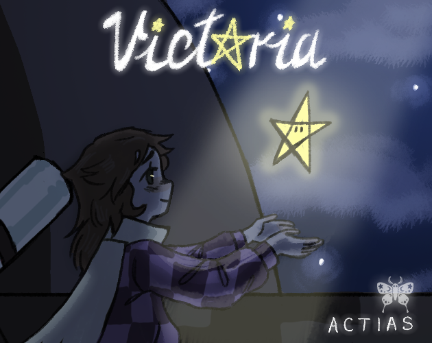
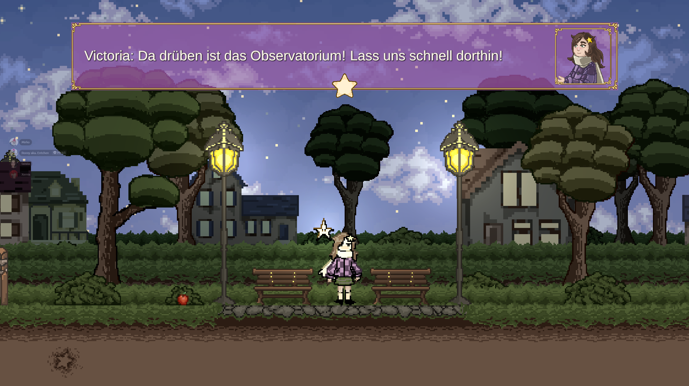
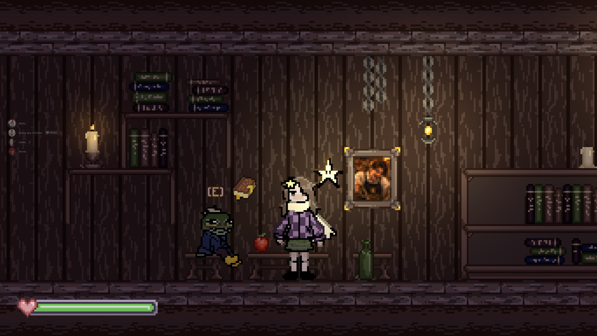
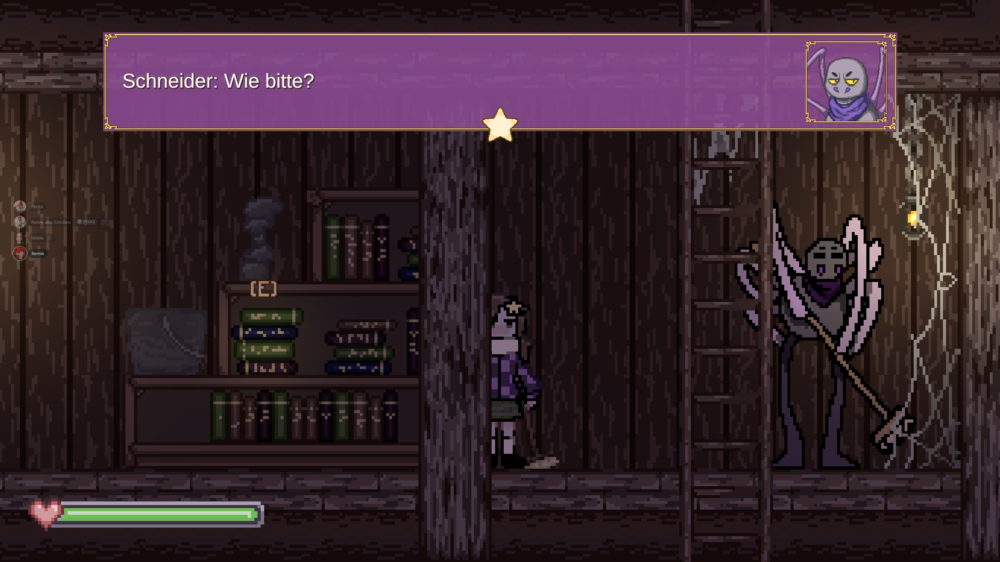
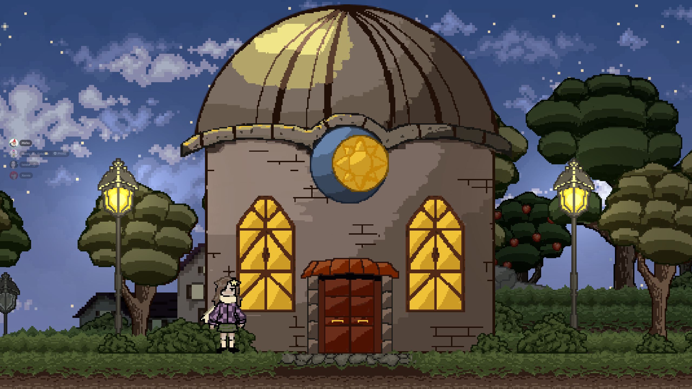
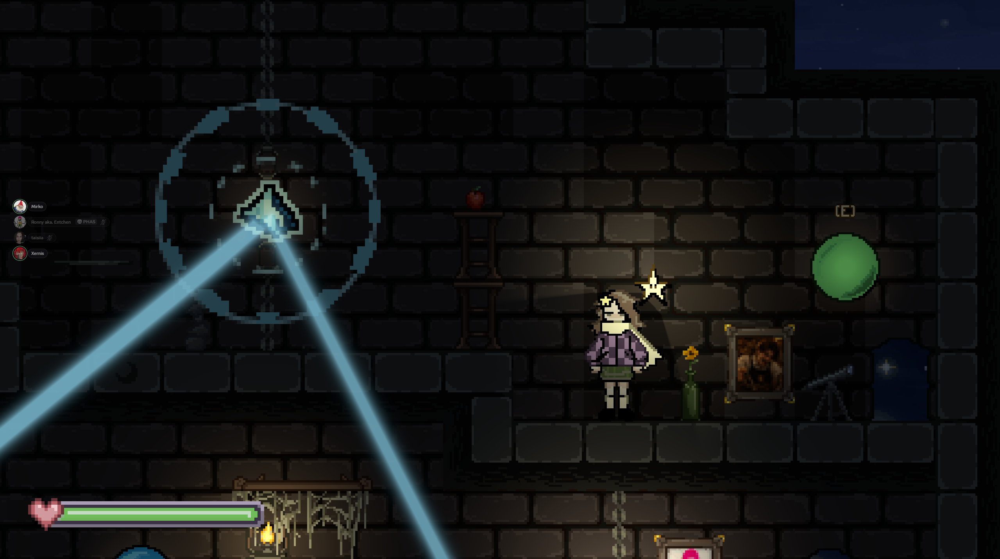

# Vict☆ria

Ein 2D Narrative Puzzle-Adventure  
First Semesterprojekt – Game Creation  
KW Design Akademie Hamburg  

---

## 🎮 About the Project

Vict☆ria is a short 2D side-scrolling puzzle platformer focused on atmosphere, light-based mechanics and environmental storytelling.

The game explores the concept of hope as an interactive system.  
Players restore fragments of light in a world consumed by darkness while solving environmental puzzles and overcoming shadow entities.

Average playtime: ~7 minutes.

## 🎮 Gameplay Screenshots

## 🖼 Screenshot

## 🌟 Light Mechanic

---

## ✨ Core Features

- Light as central gameplay mechanic
- Puzzle-platforming challenges
- Environmental interaction
- Combat encounters with shadow entities
- Crystal activation system
- Integrated storytelling without tutorials
- Symbol-based final mechanism

---

## 🕹 Controls

Keyboard & Mouse  
Gamepad supported  

(Default Unity Input System)

---

## 🛠 Technical Information

Engine: Unity 6 (6000.0.59f2)  
Render Pipeline: URP  
Target Platforms:
- WebGL
- Windows Build
- macOS Build

Resolution optimized for 16:9.

---

## 🧠 Design Philosophy

Light is not only visual feedback but a gameplay system.  
Hope is represented through interaction rather than exposition.

The visual identity combines warm light tones with cool shadow contrasts to create atmospheric depth.

All mechanics were designed to be understood through observation and experimentation.

---

## 👥 Team ACTIAS

Project Management: @Hafermilch361, @pavlikwll  
Game Design: @pavlikwll  
Level Design: @pavlikwll, @Hafermilch361  
Programming: @Xernis735, @Hafermilch361, @pavlikwll  
UI / UX Design: @Hafermilch361, @leepataisia-pixel  
Art Department: @leepataisia-pixel, @pavlikwll, @Hafermilch361  
Sound Design: @leepataisia-pixel, @Hafermilch361  

All assets were created by the team.  
No AI-generated content was used in the final game build.

---

## 📜 License

© 2026 Team ACTIAS  
Academic project created at KW Design Akademie Hamburg.

This repository is provided for documentation and educational purposes only.

Redistribution, modification or commercial use of this project or its assets is prohibited without permission.

---

## 📬 Contact

KW Design Akademie Hamburg  
Semester Project – Game Creation  
03.03.2026
